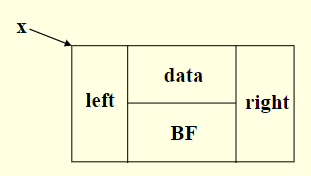
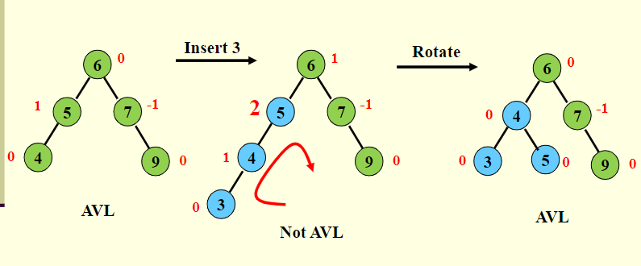
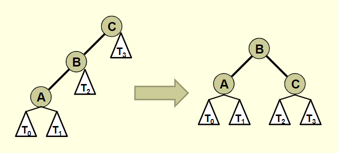
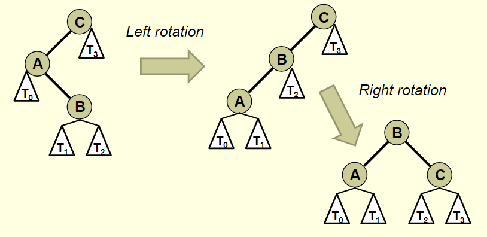

# Avl trees

- Remember that BST are used to provide O(logn) lookup, insertionm and deletion
- However, this O(logn) lookup only happens if its a complete binary tree
    - A tree where all levels are filled with the possible exception of the last level which is filled from left to right
    - Given a complete BST, the height of the tree is approcimately logn, where n is the number of nodes


Motivation for AVL Trees
=

Balanced v Unbalanced


- The unbalanced BST is basically a linked list in tree clothing
- It takes 2 tests to located 12, 3 to locate 14, and 8 to locate 52
- Hence the search effort for this tree is O(N)
- We want to maintain balance in our BSTs
- AVL trees will help maintain balance
- Its definition is:
    - A BST in which the heights of the subtrees of any given node, differ by no more than 1
    - For EVERY node in a BST, you must check the height of the left and right subtree of that node
    - If the height of those subtrees differ by no more than 1, then the BST is an AVL tree
- Thus, an AVL tree is a balanced BST


- This BST is an AVL Tree
- It takes 2 tests to locate 18, 3 to locate 12, and 4 to locate 8
- Hence, the search effort for this binary tree is O(log2n)
- For a tree with 1000 nodes, the worst case for a completely unbalanced tree is 1000 tests.
    - Again, degenerating to a linked list
- However, the worst case for a balanced tree is 10 tests

AVL Trees: Formal Definiton:
=
1) All empty trees are also, by definition, AVL trees
2) If T is a non-empty BST with T_l and T_r as its left and right subtrees, respectively, then T is an AVL tree if an only if:
    1) T_l and T_r are also AVL trees
    2) |h_l - h_r| <= 1
    (where hl and hr are the heights of Tl and Tr respectively)


- All nodes in an AVL Tree have a balance factor (bf)
- Balance factor of a node = height of the left subtree minus the height of the right subtree
- An AVL tree can have only balance factors of -1,0, or 1 at every node
- The height of a subtree is basically how many connections it has
- If it has 0 connectons then its height is also 0


## AVL Trees: Implementation

- To implement an AVL tree, simply associated a BF with each node, "x"



```sh
struct AVLTreeNode{
    int data;
    int BF;
    struct AVLTreeNode *left;
    struct AVLTreeNode *right;
}
```

In an AVL Tree, BF can be one of {-1,0,1}

## Insertion
- Insertion may cause unbalancing in the tree
- When you insert into an AVL it will be the same as a BST
- Once the new node is inserted, the balance MUST be checked and restored if the tree has become unbalanced
    - It often turns out that the new node can be inserted without affecting the height of the subtree
        - If this happens, then the balance of the root will not be changed
- The only case that causes difficulty:
    - Inserting a new node into a subtree of the root, which is taller than the other subtree, and the height of the taller subtree increases
- Thus, an AVL tree can become unbalanced due to an insertion in one of four ways:
    1) Inserting a new node into the right subtree of a right child
    2) Inserting a new node into the left subtree of a left child
        - This is the symmetric case
    3) Inserting a new node into the left subtree of a right child
    4) Inserting a new node into the right subtree of a left child
- Inserting a new node may cause the BF of some node, on the path from the root to the insertion point, to become 2 or -2
- Solution:
    - First insert the node following typical rules of a BST
    - Then from that insertion point, BACK UP towards the root, updating the bfs of all node along the path to root
    - If a node ends of with a BF of 2 or -2, you must adjust the tree by rotating around deepest such node




## Summary

Insertion summary:
- We insert following standard rules of a BST
- Then we trace back up to the root of the tree
- As we back out of the tree, constantly check the balanace factor of earch node
- When a node is out of balance, we balance it and continue back up out of the tree

Arguments for using AVL Trees:
1) Search/insertion/deletion is O(logn) since AVL trees are always balances
2) The height balancing adds no more than a constant factor to the speed of insertion

Arguments against using AVL trees:
1) Requires extra space for balancing factor
2) It may be OK to have a partially balanced tree that would give performance similar to AVL trees without requiring the balancing factor


# Insertion Revisited 

There are 4 types of trees and this is how you can restructure


There are 4 insertion Scenarios
1. Insertion into the left subtree of the left child of the root
    
2. Insertion into the right subtree of the left child of the root. 
    - This is a case where you have to use double rotations
    
3. Insertion into the left subtree of the right child of the root
    
4. Insertion into the right subtree of the right child of the root
    

Practical rules for insertion and balancing:

- Insert a node following rules of BST insertion
- Once you insert a new node, perform the following

1. Start finding the balance factors of ALL nodes along the path from the insertion point to the root
2. As soon as you find the first node out of balance, mark that node as one of your three "restructuring nodes"
3. Then, take two steps, back down, towards the insertion point and mark those two nodes as well
4. Label those "A,B,C" nodes appropriately (and subtrees)
    - Of the three nodes:
        - The smallest node should be labeled 'A'
        - The middle node should be labeled 'B'
        - Last one is 'C'
5. Restructure those three nodes (and their subtrees)

# Go to ipad notes for example

